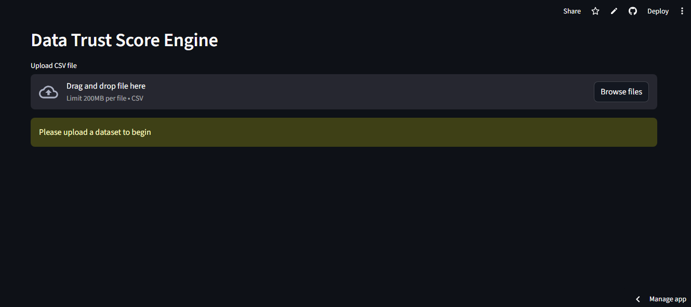
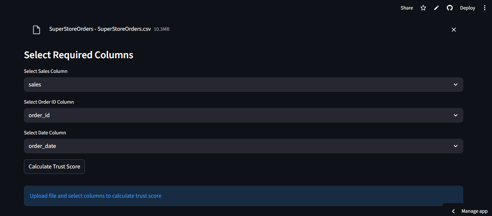
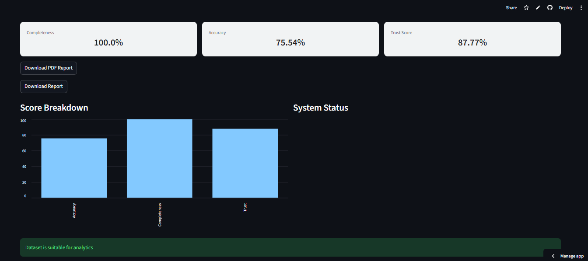
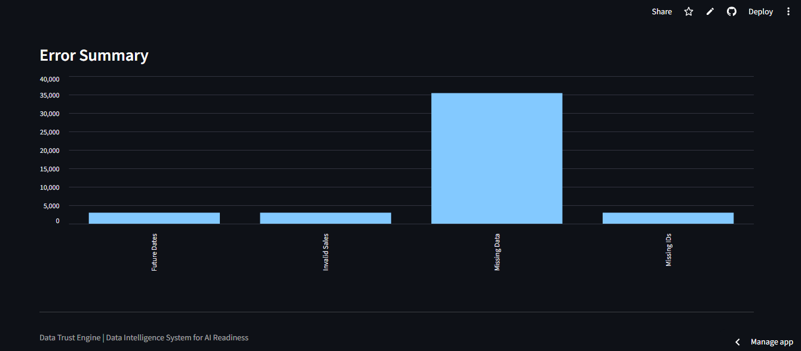

# Data Trust Score Engine

## ->> Live Demo
https://data-trust-score-engine-qkhsmyfrz9vcdzyouxza7c.streamlit.app/

## ->> Overview
A Data Intelligence application that evaluates dataset reliability for analytics and AI usage.

## ->> Features
- Upload any CSV dataset
- Dynamic column selection (sales, ID, date)
- Calculates:
  - Completeness Score
  - Accuracy Score
  - Trust Score
- Interactive dashboard with charts
- PDF report generation

## ->> Why This Project?
Most projects analyze data. This project evaluates whether data is reliable enough to be used.

## ->> Tech Stack
- Python
- Pandas
- Streamlit
- ReportLab

## ->> Run Locally
```bash
pip install -r requirements.txt
streamlit run dashboard/app.py
```
## ->> Preview

### Upload Screen


### Column Selection


### Metrics and Charts


